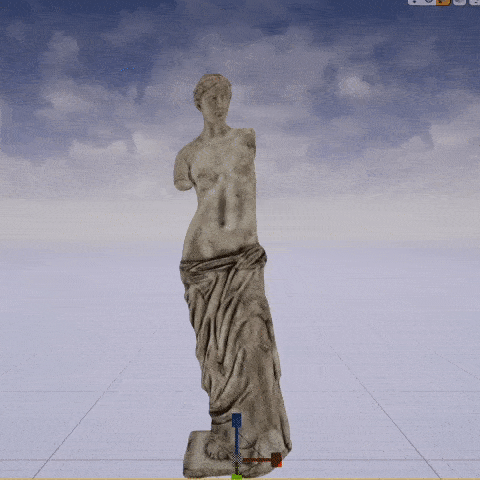

# CustomUMeshComponent

A minimal Unreal Engine 4 project that contains all the needed source code for a custom mesh component and showcases its usage. This is an example project published with a series of articles that cover the process of creating custom mesh components in UE4. 

The intro for the series can be found [here](https://medium.com/realities-io/creating-a-custom-mesh-component-in-ue4-part-0-intro-2c762c5f0cd6)

## UDeformMeshComponent
The example mesh component created in this project is a deform mesh component that can be deformed using a secondary/deform transform. The deformation is very simple; rotation and scale are interpolated by the distace between the vertex position and the secondary transform origin position (Both in world space)
Here's how it looks:

## Modules
### 1. PuzzleMesh 
Contains all the source code for the DeformMeshComponent.
#### Classes and Structs:
* UDeformMeshComponent
* FDeformMeshSection
* FDeformMeshVertexFactory
* FDeformMeshVertexFactoryShaderParameters
* FDeformMeshSceneProxy
* FDeformMeshSectionProxy

### CustomUMeshComponent
The primary game module for the project. Contains an actor that uses the DeformMeshComponent to render a mesh and deform it.
#### Classes and Structs:
* ADeformMeshActor

